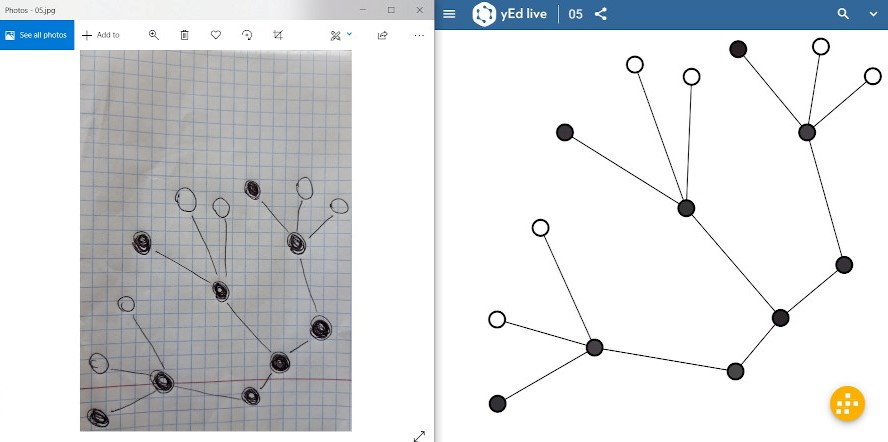
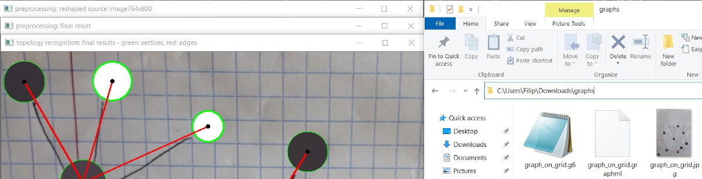
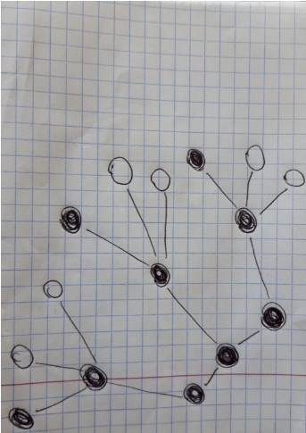
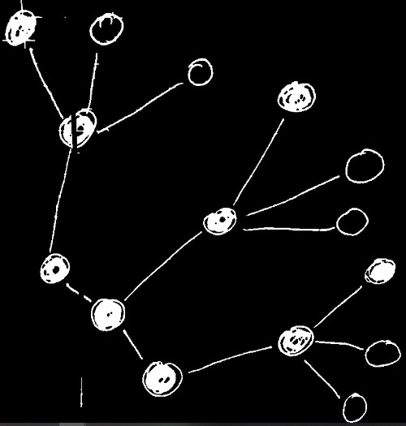
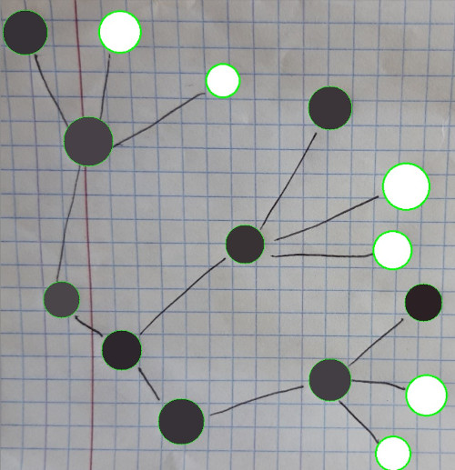
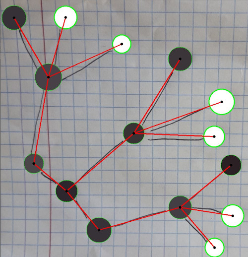

# Optical Graph Recognition (OGR) - script
Our OGR implementation is a python algorithm for recognising graphs 
([in terms of discrete mathematics](https://en.wikipedia.org/wiki/Graph_(discrete_mathematics))) in given images and 
photos (e.g. graphs from publications, hand drawn ones, etc.).

Table of contents:
- [Introduction](#introduction)
- [Technologies](#technologies)
- [Running the script](#running-the-script)
- [Processing phases](#processing-phases)
  * [Preprocessing](#preprocessing) 
  * [Segmentation](#segmentation)
  * [Topology recognition](#topology-recognition)
  * [Postprocessing](#postprocessing)
- [Future development](#future-development)
- [References and Authors](#references-and-authors)

## Introduction

Running the algorithm (script) results in files with
information about recognised graph. Example is given above - input image on the left, and resulting GraphML file on the 
right (opened in [yEd Live](https://www.yworks.com/yed-live/) graph editor).

## Technologies 
This project was developed using following technologies:
- Language: Python v3.7,
- Libraries:
  * OpenCV v4.4.0.40 (opencv-contrib-python),
  * Numpy v1.19.1.
- Environment: PyCharm Community v2020.2.1,
- Version control: git and github.

## Running the script
### Read before the first use
The best results of recognition will be achieved when the following conditions are met. Keep in mind that these are 
perfect properties that are hard to achieve and even in images of poor quality graphs are usually recognised quite well:
- Image:
  * is uniformly lighted across whole area,
  * graph is the only foreground object in the image,
  * background is uniform across whole area,
  * vertices (borders if unfilled) and edges color contrasts from background significantly.
- Vertices:
  * are **circular** (especially for unfilled vertices),
  * have similar size,
  * are filled (although unfilled ones are also recognised),
  * unfilled ones are closed contours.
- Edges:
  * are thicker than background noise (lines, grid, etc),
  * are straight lines,
  * do not intersect (although intersecting ones are also recognised).

Before running the script make sure that in your system you have installed python and libraries mentioned in the 
([Technologies](#technologies)) paragraph. 

OGR script has been developed as part of a bigger project ([repository](https://github.com/Praktyka-Zawodowa-2020)) 
including [mobile application](https://github.com/Praktyka-Zawodowa-2020/optical_graph_recognition_mobApp) and 
[server](https://github.com/Praktyka-Zawodowa-2020/optical_graph_recognition_server) on which the file format is 
validated. Therefore in order for the script to work independently:

**Make sure that your input files are images and have .jpg or .png extensions!**

### Arguments
You can read arguments descriptions below or display them by typing in the command line:

`python <path_to_main.py> -h`

Required:

  - `-p (--path) <absolute_path_to_image>` - **absolute!** path to input image (must be given).
  
Optional (*default* values are chosen when these arguments are not given):

- `-m (--mode) [mode_option]` - Input mode indicates visual properties of given graph photo. Possible `[mode_option]`
values:
  * `grid_bg` - Hand drawn graph on grid/lined piece of paper (grid/lined notebook etc.),
  * `clean_bg` - Hand drawn graph on empty uniform color background (on board, empty piece of paper, editor (paint)),
  * `printed` - Graph from a printed source (e.g. from a paper, a publication, a book, etc.),
  * `auto` - *default* - Mode is chosen automatically between grid_bg and clean_bg modes.
- `-d (--debug) [debug_opiton]` - Debug mode indicates how much debugging information will be displayed. Possible 
`[debug_opiton]` values:
  * `no` - *default* - no windows with debugging information are displayed,
  * `general` - only windows with general debugging information are displayed,
  * `full` - all windows with debugging information are displayed.
### Command line
To run the script type in the command line:

`python <path_to_main.py> -p <absolute_path_to_image> -m [mode] -d [debug]`

Following example (when in OGR folder) results in 2 additional files and some general debugging windows (see picture below): 

`python ./main.py -p "C:\Users\Filip\Downloads\graphs\graph_on_grid.jpg" -m grid_bg -d general`

Running the OGR script correctly results in 2 files with different extensions, saved in the same directory 
and with the same name as input image. Those file types are briefly described below (open links for full descriptions):
- [graph6 (.g6)](http://users.cecs.anu.edu.au/~bdm/data/formats.html) - stores only logical information about vertices 
and edges (equivalent to adjacency matrix),
- [GraphML (.graphml)](https://docs.yworks.com/yfiles/doc/developers-guide/graphml.html) - in addition to logical 
information stores visual and geometrical properties (vertex center coordinates, its color, etc.).

## Processing phases
Image processing has been divided into 4 phases, that work in the simple pipeline:

`Preprocessing -> Segmentation -> Topology Recognition -> Postprocessing`

Before any processing takes place image is loaded. For the purpose of comparison with the results after each phase 
example input image is given below.

  
### Preprocessing
The goal of this (first) phase is to prepare image for recognising vertices and edges and to do so image is:
1. reshaped to a standard size (1280x800) and rotation (horizontal)
2. converted to grayscale and binarized
3. if `auto` mode has been selected, then mode is chosen automatically
4. noise is filtered (eg. grid is removed)
5. croped to remove unnecessary background around graph

Image after preprocessing (below) is the input of the next (Segmentation) phase.

### Segmentation
Second phase recognises vertices (divide pixels into vertices and edges ones) in following steps:
1. Unfilled vertices are filled
2. Edges are removed 
3. Vertices are recognised 

Segmentation results with a vertices list, which is the input (along binary image) for the Topology Recognition phase.
Visualisation of a list (taken from `full` debug) is given below.

### Topology Recognition
In this phase edges are recognised (connections between vertices) in following steps:
1. Vertices pixels are removed from binary image
2. Lines intersections are removed
3. Line segments are approximated from contours to 2 endpoints
4. Edges are created by linking line segments
5. Connection between vertices are assigned to adjacency list

Topology recognition updates each vertex object in a list with information about adjacent vertices. Updated list is the input 
for Postprocessing phase (visualisation from `full` debug below).

### Postprocessing
In the postprocessing phase 2 files, storing graph information, are created from adjacency list (description in 
[Command line](#command-line) paragraph). GraphML file is created accordingly to 
[yWorks documentation](https://docs.yworks.com/yfiles/doc/developers-guide/graphml.html) and graph6 file accordingly to 
[official documentation](http://users.cecs.anu.edu.au/~bdm/data/formats.txt).

## Future development
There are definitely some features to improve, especially handling the intersections which could be improved by 
storing removed intersection points coordinates, and later using these points to link segments into edges.
File extension validation can also be implemented, as well as working with relative paths to input image. If you want
to further develop this solution remember that we created it during apprenticeship at the [Gdansk University of 
Technology](https://pg.edu.pl/en) and as far as I know this code is their intellectual property (so its best to contact 
our [project coordinator](https://pg.edu.pl/7c4980df68_kacper.wereszko/wizytowka), at email address: 
kacper.wereszko@pg.edu.pl).

## References and Authors
The idea for OGR, and some adapted solutions were taken from publication: 
"[Optical Graph Recognition](https://link.springer.com/content/pdf/10.1007%2F978-3-642-36763-2_47.pdf)" written by 
Christopher Auer, Christian Bachmaier, Franz J. Brandenburg, Andreas Gleißner, and Josef Reislhuber.

Some ideas and solutions have been taken and adapted from 
[yWorks article](https://www.yworks.com/blog/projects-optical-graph-recognition) about "Recognizing graphs from images".

A lot of solutions and knowledge about opencv has been taken from 
[offical opencv python tutorials](https://opencv-python-tutroals.readthedocs.io/en/latest/py_tutorials/py_tutorials.html).

This solution has been mainly developed during summer 2020 one month apprenticeship at the [Gdansk University of 
Technology (GUT)](https://pg.edu.pl/en) by:
#### Filip Chodziutko and Kacper Nowakowski 2020
